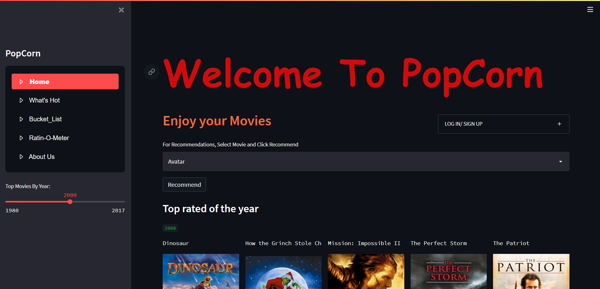
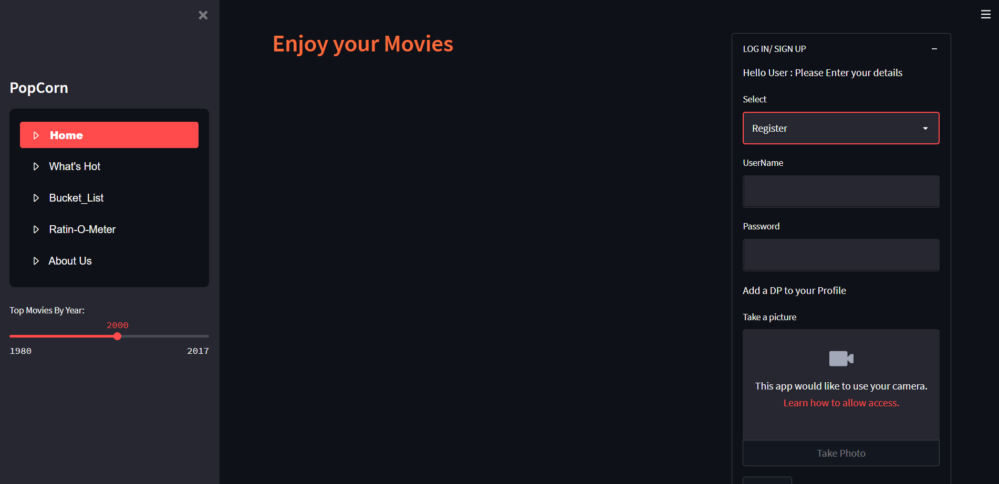
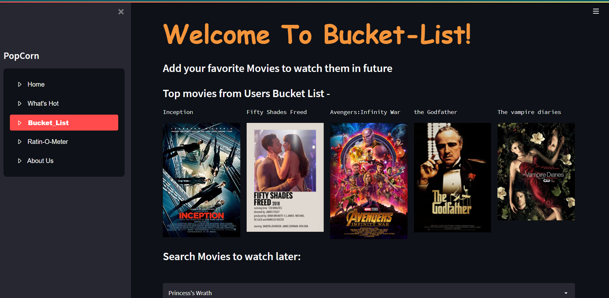
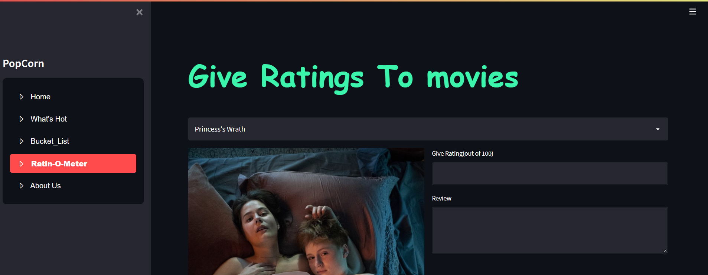
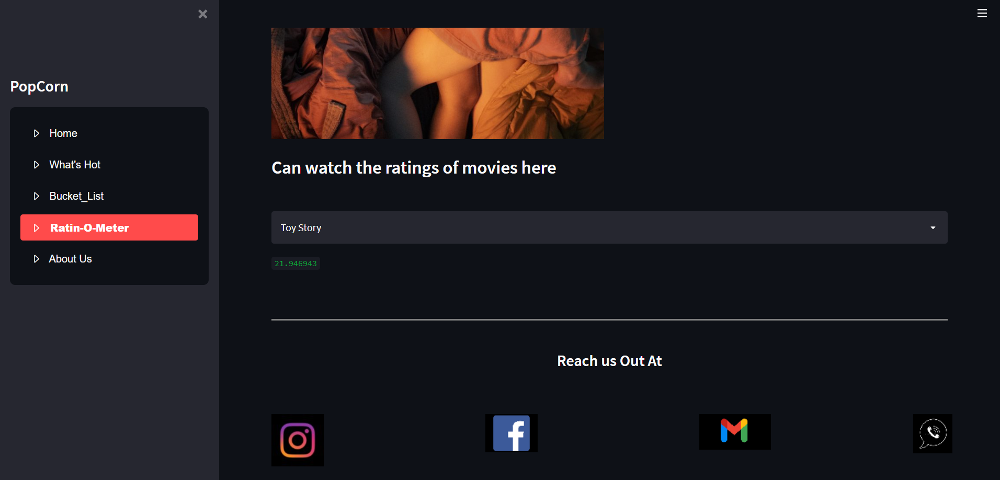
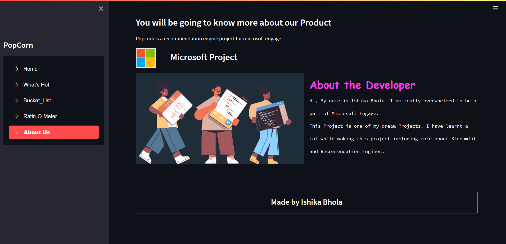

# Hi there, I'm Ishika👋
## PopCorn-Movie Recommendation Engine
Click [Popcorn_recommendation-Engine](https://popcorn-movie-recommender.herokuapp.com/), to checkout my website and engine.

The website is being hosted at Heroku. Welcome to PopCorn Recommendation Engine. 
We are here to Recommend you the best movies. We have used both Content-Bases Filtering and Collaborative-Bases Filtering for our engine.
It also uses a searching algorithm which effectively guide you to find the perfect movie for you. It is a multi feature application that allows the user to 

--> Search and get recommendation by a particular movie/according to other user interests. 

--> Search and get recommendation by year 

--> create a self curated bucket-list for specific future interests and will also show you movies similar to that movie. 

--> Rate movies and get to know the ratings of other users and movies in order to decide their preferences 

--> Login/Signup to save app data 

--> Change theme of the website according to one's preference and comfort. 

The Dataset used is a subset of TMDb movies-dataset as well as Imdb Dataset. The datasets, being larger files, have been uploaded on a drive of which the link has been attached. 

And similarity.pkl file which stores the vectorization and similarity points for movies, has also been uploaded on the drive of which the link has been attached.

https://drive.google.com/file/d/1-Njc5E-KZ_WxEWbrAQbyJVjJlqYe8o18/view?usp=sharing

https://drive.google.com/file/d/1iH9sn3QZC1ipRdSZyexMUYHU-VQBGZLw/view?usp=sharing

https://drive.google.com/file/d/1y53VKHAkIuSRMyd8HDJ573DiXr7_4V9h/view?usp=sharing

## Website
All the features added relate to recmmendation engine and are given to provide you with the best recommendations and brighten your day.
There are many features of which some are shown below:

1. So the Home Page of the website looks like this:
[]()

You have to click on Recommend for movies to get recommended. Additionally, you can get recommendations by year, genre as well as user ratings.
So its a hybrid mode recommendation engine.

[]()

You can also Login/Register to our website. And If you choose to Register, you can also add a dp to your profile.

2. This Shows the Bucket-list Page
[]()

One of the most important part of Popcorn Recommender is Bucket-List where you can watch the top rated movies in the bucket list of our users as well as add to yiur watch later or Bucket list.

3. This is ratin-O-Meter
[]()

Another important feature of Popcorn is Ratin-O-Meter. Here you can give ratings and reviews to a movie, which we are gonna for the betterment of your recommendations.

[]()

You can also get ratings of various movies given by users and popularity taken out by us out of 100 and in this way you can select the best movie for yourself.

4. Know More About me and the Project
[]()

So what are you waiting for, go to our website, get recommendations, give rating and reviews, make your bucket list, share it with us, amd enjoy with the movies at the fullest. Ok Bye, I have to get recommended by Popcorn and watch the best movie for myself.

## Deployment

All the required dependencies are listed in the requirements.txt file To install type the following command
```bash
  pip freeze > requirements.txt
```
After installing all the dependecies using, To deploy this project run

```bash
  streamlit run app.py
```


## Support

For support, email ishikabhola23@gmail.com.

## I'm a student at Bits Hyderabad!!
- 🌱 I’m currently learning everything 🤣
- 🥅 2022 Goals: Learn more about web3
- ⚡ Fun fact: I like to draw and play guitar/drums

### Connect with me:

[]()
[]()
&nbsp;&nbsp;
[]()
[]()
&nbsp;&nbsp;
[]()
[]()
&nbsp;&nbsp;
[]()
[]()
&nbsp;&nbsp;
[]()
[]()
